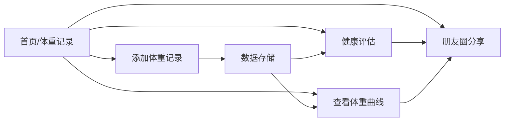

## 1. 产品概述

体重记录管理系统是一款帮助用户科学管理体重的健康类应用，通过记录每日体重数据、可视化趋势曲线、智能健康评估和社交分享功能，激励用户坚持健康生活方式。

- 目标用户：关注体重管理、健康生活的人群
- 核心价值：数据可视化 + 健康指导 + 社交激励

## 2. 核心功能

### 2.1 功能模块

1. **体重记录页面**：添加/编辑/删除体重记录，显示历史记录列表
2. **体重曲线页面**：折线图展示体重趋势，支持时间范围筛选
3. **健康评估页面**：BMI 计算、健康等级、个性化建议
4. **朋友圈分享页面**：分享体重成就，查看好友动态，点赞互动

### 2.3 页面详情

| 页面名称 | 模块名称 | 功能描述 |
|---------|---------|---------|
| 体重记录 | 记录表单 | 输入体重(kg)、日期、备注信息 |
| 体重记录 | 记录列表 | 展示历史记录卡片，支持编辑/删除 |
| 体重记录 | 统计概览 | 最新体重、增减量、累计变化 |
| 体重曲线 | 图表区域 | 折线图展示体重变化趋势 |
| 体重曲线 | 时间筛选 | 7天/30天/90天/全部 切换 |
| 体重曲线 | 目标线 | 显示目标体重参考线 |
| 健康评估 | 个人信息 | 身高、性别、年龄输入 |
| 健康评估 | BMI 计算 | 实时计算 BMI 并显示等级 |
| 健康评估 | 健康建议 | 根据 BMI 给出运动饮食建议 |
| 朋友圈 | 发布动态 | 分享体重变化、添加文字和图片 |
| 朋友圈 | 动态列表 | 瀑布流展示好友动态 |
| 朋友圈 | 互动功能 | 点赞、评论、删除自己的动态 |

## 3. 核心流程

用户打开应用后，可在体重记录页添加当日体重；切换到曲线页查看趋势；在评估页查看健康分析；满意成果后可在朋友圈分享进步。

## 4. 用户界面设计

### 4.1 设计风格

- **主色调**：清新绿色渐变（#10B981 → #059669），象征健康活力
- **辅助色**：温暖橙色（#F97316）用于强调数据变化
- **中性色**：米白背景（#FAFAF9），深灰文字（#1C1917）
- **按钮风格**：大圆角胶囊按钮（rounded-full），带微阴影和悬停缩放
- **字体**：标题使用「思源黑体 Bold」，正文「思源黑体 Regular」
- **布局风格**：卡片式布局，顶部 Tab 导航，柔和阴影
- **图标风格**：Lucide 线性图标，统一描边宽度

### 4.2 页面设计概览

| 页面名称 | 模块名称 | UI 元素 |
|---------|---------|---------|
| 体重记录 | 统计概览 | 渐变卡片、大号数字、增减箭头、趋势标签 |
| 体重记录 | 记录表单 | 浮动输入框、日期选择器、渐变提交按钮 |
| 体重记录 | 记录列表 | 卡片列表、滑动删除、编辑弹窗、日期标签 |
| 体重曲线 | 图表区域 | 平滑曲线、渐变填充、数据点悬浮提示 |
| 体重曲线 | 时间筛选 | 药丸式 Tab、选中态高亮背景 |
| 健康评估 | BMI 展示 | 半圆形仪表盘、颜色分级指示、数值动画 |
| 健康评估 | 建议卡片 | 图标 + 标题 + 描述、分类标签、可展开详情 |
| 朋友圈 | 发布区 | 头像 + 输入框 + 快捷表情、图片预览 |
| 朋友圈 | 动态列表 | 用户头像、时间戳、配图、点赞爱心、评论区 |

### 4.3 响应式

桌面端优先设计，最大宽度 1200px 居中显示；移动端（<768px）自适应为单列布局，底部 Tab 导航，触摸目标 ≥44px。
