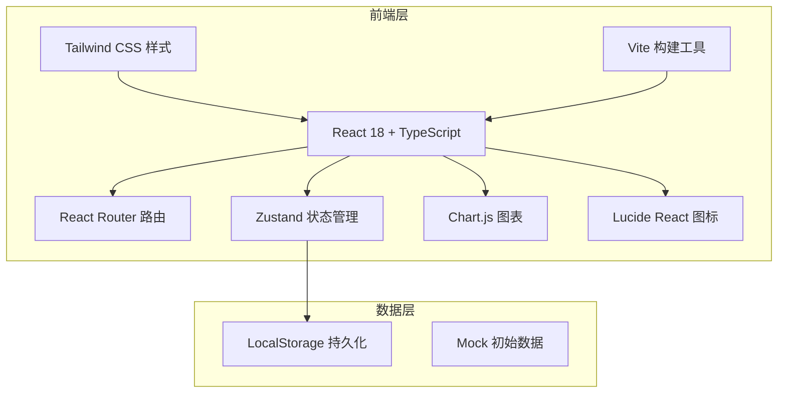
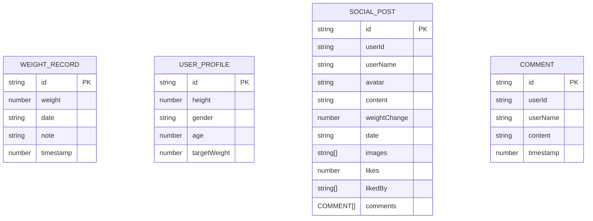

## 1. 架构设计



## 2. 技术说明

- 前端：React@18 + TypeScript + Vite
- 构建工具：Vite@5
- 样式框架：Tailwind CSS@3
- 路由：React Router DOM@6
- 状态管理：Zustand
- 图表库：Chart.js + react-chartjs-2
- 图标：Lucide React
- 数据存储：LocalStorage（前端模拟持久化）
- 初始化工具：vite-init 使用 react-ts 模板

## 3. 路由定义

| 路由 | 页面 | 说明 |
|-----|------|-----|
| / | 体重记录 | 默认首页，记录和列表 |
| /chart | 体重曲线 | 图表展示趋势 |
| /health | 健康评估 | BMI 计算和建议 |
| /social | 朋友圈 | 社交分享动态 |

## 6. 数据模型

### 6.1 数据模型定义



### 6.2 TypeScript 类型定义

```typescript
interface WeightRecord {
  id: string;
  weight: number;
  date: string;
  note?: string;
  timestamp: number;
}

interface UserProfile {
  id: string;
  height: number;
  gender: 'male' | 'female';
  age: number;
  targetWeight?: number;
}

interface Comment {
  id: string;
  userId: string;
  userName: string;
  content: string;
  timestamp: number;
}

interface SocialPost {
  id: string;
  userId: string;
  userName: string;
  avatar: string;
  content: string;
  weightChange?: number;
  date: string;
  images: string[];
  likes: number;
  likedBy: string[];
  comments: Comment[];
}
```
